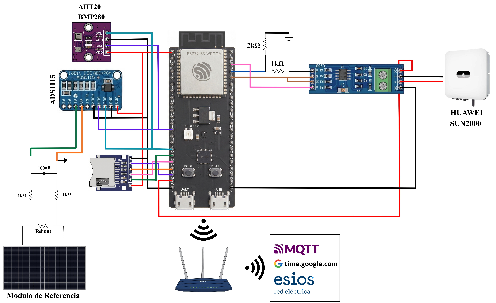
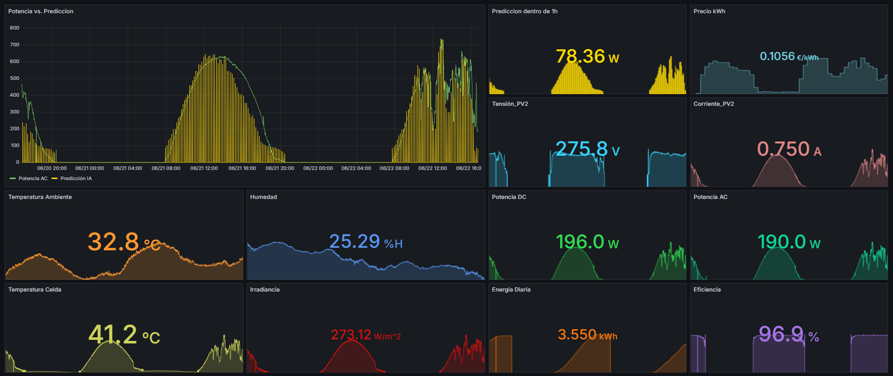

# ☀️ Sistema Embebido Inteligente basado en Edge AI y TinyML para Predicción de Potencia Fotovoltaica


  

  

    
## 🚀 Sobre mi
Este repositorio pertenece a Aitor Casado de la Fuente, estudiante de Ingeniería Electrónica por la Universidad Politécnica de Madrid.


## 📜 Sobre el Proyecto

Este repositorio contiene el firmware y la arquitectura de diseño de un __Sistema Embebido Inteligente de Bajo Coste__ orientado a la monitorización avanzada y predicción de potencia en instalaciones solares de autoconsumo.

El núcleo del proyecto reside en la aplicación del paradigma __Edge AI (TinyML)__. Mediante el despliegue de una Red Neuronal Recurrente (LSTM) fuertemente optimizada y cuantizada dentro de la memoria flash de un microcontrolador ESP32-S3, el sistema es capaz de predecir la generación de Potencia Activa (AC) a una hora vista de forma totalmente autónoma. Este enfoque descentralizado elimina la dependencia del procesamiento en la nube (Cloud Computing), reduciendo drásticamente la latencia, optimizando el ancho de banda de la red IoT y garantizando la privacidad de los datos energéticos del usuario.

Además de su capacidad predictiva, el dispositivo opera como un nodo de instrumentación industrial robusto. Recopila telemetría ambiental mediante buses I²C, digitaliza señales analógicas diferenciales de un panel de referencia y extrae los registros de producción directamente de inversores comerciales a través de RS-485 (Modbus RTU).

Por último, toda esta telemetría la envía mediante el protocolo MQTT a u bróker para la posterior visualización de los datos en Grafana.

## ✨ Características Principales

- __Inteligencia Artificial en el Borde (Edge AI):__ Inferencia local mediante modelos LSTM en C/C++ validada mediante técnicas Hardware-In-the-Loop (HIL), alcanzando un coeficiente de determinación (R^2) superior al 0.90 en entornos de producción.
- __Telemetría Industrial:__ Adquisición de datos determinista e integración directa con inversores Huawei prescindiendo de librerías externas de alto nivel para el protocolo Modbus.

- __Comunicaciones IoT:__ Empaquetado de cargas útiles en JSON y transmisión periódica a un servidor de visualización y base de datos local a través del protocolo MQTT.

- __Tolerancia a Fallos:__ Sincronización temporal vía NTP, filtrado de ruido mediante fusión de sensores y almacenamiento redundante de la telemetría en tarjeta MicroSD para operar ante caídas de red.

- __Diseño Orientado al "Prosumidor":__ Arquitectura concebida con componentes COTS de bajo coste para facilitar la democratización de las Smart Grids y optimizar la gestión energética residencial.

## 🏗️ Arquitectura y Hardware

El diseño físico de este prototipo se ha estructurado para garantizar la máxima fiabilidad en entornos de producción, combinando el procesamiento perimetral (*Edge Computing*) con instrumentación industrial robusta. 

A continuación se muestra el diagrama de bloques general del sistema:



### Lista de Materiales (BOM)

El nodo sensor ha sido ensamblado utilizando los siguientes componentes principales:

* **Microcontrolador Principal (ESP32-S3):** Actúa como el cerebro del sistema. Encargado de la orquestación de periféricos, las comunicaciones Wi-Fi (MQTT) y la ejecución local de la red neuronal recurrente (LSTM) en memoria Flash.
* **Adquisición Analógica de Alta Precisión (ADS1115):** Conversor ADC de 16 bits operando a través del bus I²C. Se utiliza para la digitalización de la caída de tensión en la resistencia *shunt*, permitiendo una lectura diferencial estricta en el lado de baja tensión (*Low-Side*) del panel fotovoltaico de referencia.
* **Módulo de Regulación de Potencia (MP1584):** Conversor DC/DC tipo *Buck* de alta eficiencia. Se encarga de reducir la tensión industrial de 24 V a niveles lógicos estables (5 V / 3.3 V). Cuenta con un condensador electrolítico en la etapa de entrada para la absorción de transitorios inductivos (*Hot-plugging*).
* **Interfaz de Comunicaciones (RS-485):** Transceptor para la lectura continua de los registros energéticos del inversor Huawei mediante el protocolo industrial Modbus RTU.
* **Sensores Ambientales (AHTxx):** Adquisición de la temperatura ambiente y humedad relativa, parámetros necesarios para alimentar el modelo termodinámico (NOCT) y estimar el rendimiento térmico de las células fotovoltaicas.
* **Almacenamiento Local (Módulo MicroSD):** Implementado para respaldar la telemetría y los resultados de inferencia en formato CSV de forma continua, garantizando la persistencia de los datos ante posibles caídas en la conectividad del *bróker* MQTT.

## 🛠️ Validación Hardware-In-the-Loop (HIL)

Una de las fases más críticas en el desarrollo de este proyecto fue la evaluación determinista de los modelos embebidos (LSTM y GRU) bajo las estrictas restricciones de memoria y procesamiento del microcontrolador **ESP32-S3**. Para garantizar una validación rigurosa antes de su despliegue en producción, se implementó una metodología de pruebas **Hardware-In-the-Loop (HIL)**.

### Metodología de Prueba HIL

Aunque físicamente el banco de pruebas consistía en el microcontrolador en una *protoboard*, el flujo de validación HIL permitía someter al silicio a una carga de datos real y evaluar su comportamiento perimetral (*Edge*). El proceso se orquestó siguiendo la arquitectura detallada a continuación:


El flujo de datos se estructuró de la siguiente manera:

1. **Inyección de Datos Operacionales (Python):** Se diseñó un *script* en Python que, haciendo uso de la librería `pyserial`, inyectaba variables históricas de entrada (irradiancia global, temperatura ambiente, etc.) al ESP32-S3 a través del puerto serie (UART).
2. **Procesamiento Perimetral (TinyML en ESP32-S3):** El microcontrolador, ejecutando las redes neuronales LSTM y GRU fuertemente optimizadas, escuchaba ininterrumpidamente, gestionando los datos entrantes mediante un *buffer* circular como ventana deslizante. Según llegaban las tramas, los modelos realizaban la inferencia de potencia AC.
3. **Auditoría de Rendimiento:** Junto con el valor de la predicción, el *firmware* del ESP32-S3 calculaba y devolvía al PC la **latencia de inferencia** exacta (tiempo de CPU consumido por la red neuronal).
4. **Análisis y Métricas:** El *script* de Python almacenaba esta telemetría (predicción y latencia), permitiendo el cálculo de las métricas de evaluación final (MAE, RMSE y $R^2$) y la representación gráfica del rendimiento real del silicio frente a la simulación.

### Resultados y Conclusiones de HIL

Esta metodología HIL permitió confirmar empíricamente la viabilidad del concepto de **#EdgeAI**, demostrando la capacidad del ESP32-S3 para predecir la generación fotovoltaica a una hora vista de forma precisa, determinista y totalmente autónoma (sin depender de la nube).

## 🔧 Software y Librerías

Este proyecto está construido sobre el framework de PlatformIO y utiliza las siguientes librerías:

* `adafruit/Adafruit ADS1X15`
* `adafruit/Adafruit Unified Sensor`
* `adafruit/Adafruit AHTX0`
* `adafruit/Adafruit BusIO`
* `knolleary/PubSubClient`
* `bblanchon/ArduinoJson`
## 📁 Estructura del Repositorio

El repositorio está organizado de la siguiente manera. Cada archivo que comienza con la cabecera `"ESP32_"` es una prueba modular del presente proyecto, la cuál está ordenada de la siguiente forma:

```text
├── .pio/                  # Código fuente en C++ para ESP32-S3 (PlatformIO)
│   ├── build/             # Archivos de código fuente 
│   ├── libdeps/           # Librerías y dependencias externas
├── .vscode/               # Archivo de entrorno vscode
├── include/               # Contiene archivos .h
├── lib/                   # Archivo readme
├── src/                   # Archivo .cpp con la lógica completa
├── test/                  # N/A
├── .gitignore             # N/A
└── platformio.ini/        # Archivo de cofiguración del proyecto
```
## ⚙️ Diseño PCB
Con el objetivo de hacer un proyecto para funcionar en un entorno de producción real, se ha diseñado una PCB a 2 capas del estilo **carrier board**. Cada símbolo y huella de los componentes que aparecen en la PCB ha sido diseñado por el propio estudiante, además de que el enrrutado ha sido realizado de forma manual. Se ha diseñado para que el sistema funciona de forma autónoma gracias a una tensión de 24V. Esta primera imagen es el diseño en 3D de la PCB:


Y la siguiente foto es la PCB en el entorno de producción real dentro de la caja de conexiones:
## 📊 Visualización de Datos - Monitorización en Tiempo Real

Toda la telemetría enviada por el ESP32-S3 llega a un bróker MQTT lanzado desde un ordenador local, en el cuál también están ejecutándose Node-RED e InfluxDB para el redireccionamiento y almacenamiento de la telemetría. Posteriormente, los datos se visualizan en Grafana de la siguiente manera:

